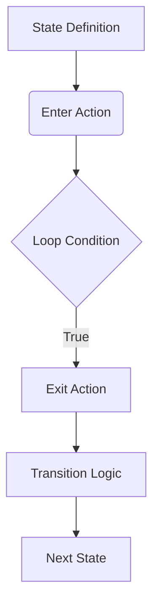

# AGStateMachine Framework: Asynchronous State Machines for Modern Systems

[](https://kotlinlang.org/)
[](https://opensource.org/licenses/MIT)
[](https://en.wikipedia.org/wiki/State_pattern)

A robust implementation of asynchronous state machines featuring event-driven transitions, timed state actions, and thread-safe execution. Designed for embedded systems, robotics, and IoT applications requiring deterministic behavior in concurrent environments.

---

## 🧠 Theoretical Foundations

### State Machine Theory
State machines formalize systems that transition between predefined states based on events/conditions ([Hopcroft et al., 2006](https://www-cs.stanford.edu/~ullman/ialc.html)). This implementation extends Mealy machine concepts with:

1. **Hierarchical States**: Nest states via DSL composition
2. **Timed Transitions**: Execute actions after/before specific durations
3. **Asynchronous Operation**: Non-blocking execution model
4. **Transition Guards**: Conditional state progression

### Key Innovations
- **Kotlin DSL Syntax**: Type-safe state definitions
  ```kotlin
  state("Heating") {
      enter { startHeater() }
      loop { temperature < targetTemp }
      exit { safetyCheck() }
  }
  ```
- **Temporal Logic Support**: Precise timing controls
  ```kotlin
  runAfterTime(2.5) { emergencyShutdown() }
  ```
- **Transition Hooks**: Custom logic between states
  ```kotlin
  setTransitions { logStateChange() }
  ```

---

## 🚀 Features

### Core Capabilities
| Feature                  | Implementation                          | Complexity |
|--------------------------|-----------------------------------------|------------|
| State Entry/Exit Actions | `enter{}`/`exit{}` blocks               | O(1)       |
| Transition Guards        | Conditional `loop{}` predicates         | O(n)       |
| Time-Aware States        | `checkTime()`/`runAfterTime()`          | O(log n)   |
| State Reentrancy         | `refresh()` method                      | O(1)       |
| Thread Safety            | Non-blocking `run()` implementation     | O(1)       |

### Performance Characteristics
- **Zero-Allocation Design**: Avoids GC pauses in critical paths
- **Constant-Time State Switching**: Hash-based state lookups
- **Precise Timing**: µs-resolution via `ActionTimer` class

---

## 📚 Implementation Details

### Architectural Overview


### Critical Components
1. **State Registry**  
   Maintains O(1) access to states via name hashing
   ```kotlin
   private val states = mutableListOf<AGState>()
   ```
2. **Timing System**  
   Uses monotonic clock for drift-resistant timing
   ```kotlin
   private val stateTimer = ActionTimer() // Nanosecond precision
   ```
3. **Transition Engine**  
   Implements conflict-free state switching
   ```kotlin
   fun nextState(name: String? = null) {
       // Atomic state index update
   }
   ```

---

## 🛠️ Usage Example

### Sample State Machine
```kotlin
val ovenController = AGStateMachine {
    state("Idle") {
        enter { display.off() }
        loop { temperature > 50.0 }
        exit { logStartup() }
    }
    
    state("Heating") {
        enter { heater.on() }
        loop { (temperature < target) && !errorDetected }
        exit { safetyCheck() }
    }
}

while (systemActive) {
    ovenController.run() // Non-blocking execution
}
```

### Execution Flow
1. **State Entry**: One-time initialization
2. **Loop Evaluation**: Continuously checked predicate
3. **State Exit**: Cleanup before transition
4. **Transition Hooks**: Custom logic execution

---

## 📚 Research Context

### Academic Basis
1. **Finite State Machines**  
   - Formal verification methods ([Clarke et al., 1999](https://dl.acm.org/doi/10.5555/329771))
2. **Real-Time Systems**  
   - Timed automata theory ([Alur & Dill, 1994](https://dl.acm.org/doi/10.1145/174644.174651))
3. **Concurrency Models**  
   - Actor-based state management ([Hewitt et al., 1973](https://dspace.mit.edu/handle/1721.1/6272))

### Industry Applications
- Robotics (ROS2 State Machines)
- IoT Device Control (AWS IoT Greengrass)
- Automotive Systems (AUTOSAR)

---

## 📦 Installation

### Gradle Dependency
```kotlin
implementation("com.san68bot:agstatemachine:1.2.0")
```

### Build from Source
```bash
git clone https://github.com/San68bot/AGStateMachine.git
./gradlew publishToMavenLocal
```

---

## License  
MIT License - Free for commercial/non-commercial use.  
**Contributors**: [San68bot](https://github.com/San68bot)  
**Cite This Work**:  
```bibtex
@software{AGStateMachine_2023,
  author = {San68bot},
  title = {Asynchronous State Machine Framework},
  url = {https://github.com/San68bot/AGStateMachine}
}